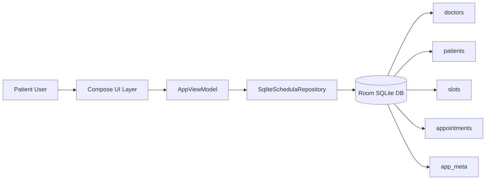
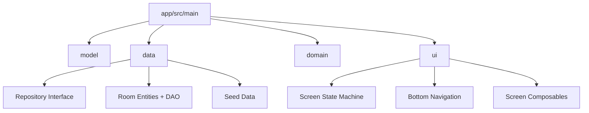

# Architecture

## System Overview

## Module Structure

## Local-First Boundary

- Source of truth: local Room database.
- App boot: `ensureSeeded()` populates local tables for first-run demo behavior.
- All read models in UI are `Flow` streams from DAO observers.
- Login persistence uses `app_meta.logged_in_phone`.

## Why This Shape

- Interns can trace each feature end-to-end in one module.
- Data layer still uses production-like boundaries (DAO -> repository -> ViewModel).
- No hidden framework magic: explicit state, explicit transitions.
