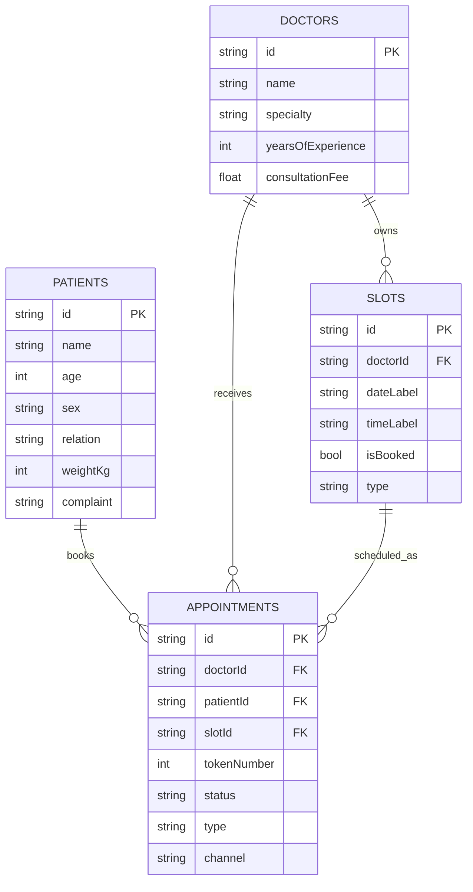
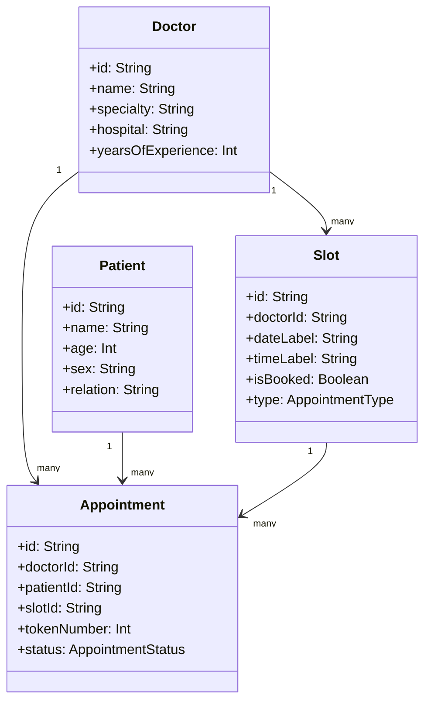

# Data Model

## Logical ERD

```mermaid
erDiagram
  DOCTORS ||--o{ SLOTS : owns
  PATIENTS ||--o{ APPOINTMENTS : books
  DOCTORS ||--o{ APPOINTMENTS : receives
  SLOTS ||--o{ APPOINTMENTS : scheduled_as

  DOCTORS {
    string id PK
    string name
    string specialty
    int yearsOfExperience
    float consultationFee
  }

  PATIENTS {
    string id PK
    string name
    int age
    string sex
    string relation
    int weightKg
    string complaint
  }

  SLOTS {
    string id PK
    string doctorId FK
    string dateLabel
    string timeLabel
    bool isBooked
    string type
  }

  APPOINTMENTS {
    string id PK
    string doctorId FK
    string patientId FK
    string slotId FK
    int tokenNumber
    string status
    string type
    string channel
  }
```

## Domain Models

```mermaid
classDiagram
  class Doctor {
    +id: String
    +name: String
    +specialty: String
    +hospital: String
    +yearsOfExperience: Int
  }

  class Slot {
    +id: String
    +doctorId: String
    +dateLabel: String
    +timeLabel: String
    +isBooked: Boolean
    +type: AppointmentType
  }

  class Patient {
    +id: String
    +name: String
    +age: Int
    +sex: String
    +relation: String
  }

  class Appointment {
    +id: String
    +doctorId: String
    +patientId: String
    +slotId: String
    +tokenNumber: Int
    +status: AppointmentStatus
  }

  Doctor "1" --> "many" Slot
  Doctor "1" --> "many" Appointment
  Patient "1" --> "many" Appointment
  Slot "1" --> "many" Appointment
```
