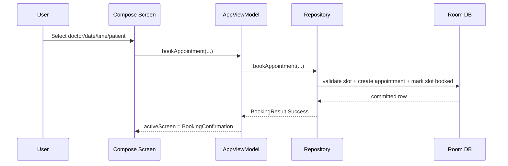
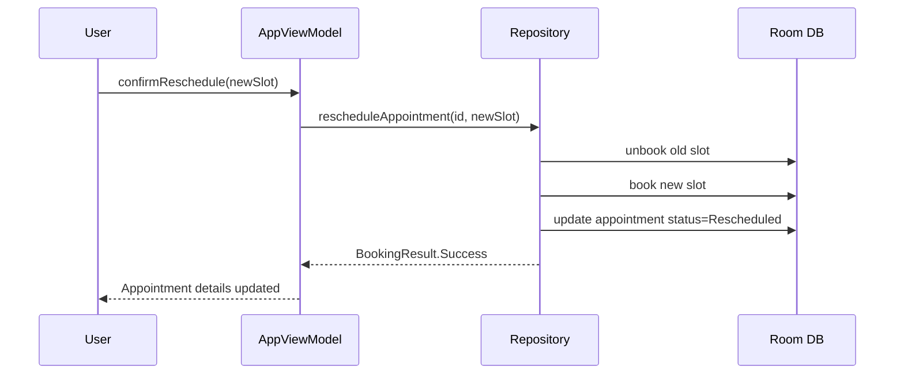

# Design

## UX Goals

- Keep navigation predictable.
- Keep forms short and direct.
- Keep booking flow linear and recoverable.
- Preserve all key wireframe capabilities as navigable screens.

## Functional Areas

1. Authentication (OTP)
2. Doctor discovery
3. Booking (date, time, patient, confirmation/failure)
4. Appointment management (details, cancel, reschedule)
5. Patient engagement (chat, reminders, reengagement)
6. Support & social features (friends/family, review, collaboration)

## Booking Interaction

## Reschedule Interaction

## Error Strategy

- Slot race/conflict: returns `BookingResult.SlotUnavailable`.
- Validation errors: handled in ViewModel before repository call.
- UI feedback: snackbar + fallback screen for booking failure.
