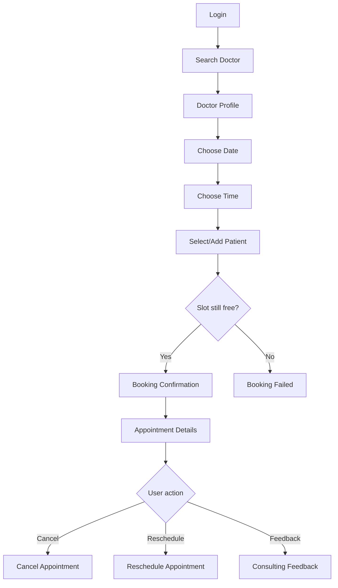
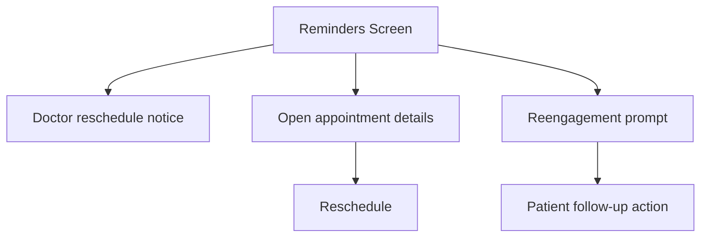

# Flowcharts

## End-to-End Appointment Flow

```mermaid
flowchart TD
  A[Login] --> B[Search Doctor]
  B --> C[Doctor Profile]
  C --> D[Choose Date]
  D --> E[Choose Time]
  E --> F[Select/Add Patient]
  F --> G{Slot still free?}
  G -- Yes --> H[Booking Confirmation]
  G -- No --> I[Booking Failed]
  H --> J[Appointment Details]
  J --> K{User action}
  K -- Cancel --> L[Cancel Appointment]
  K -- Reschedule --> M[Reschedule Appointment]
  K -- Feedback --> N[Consulting Feedback]
```

## Reminder and Reengagement Flow

```mermaid
flowchart TD
  R1[Reminders Screen] --> R2[Doctor reschedule notice]
  R1 --> R3[Open appointment details]
  R3 --> R4[Reschedule]
  R1 --> R5[Reengagement prompt]
  R5 --> R6[Patient follow-up action]
```
