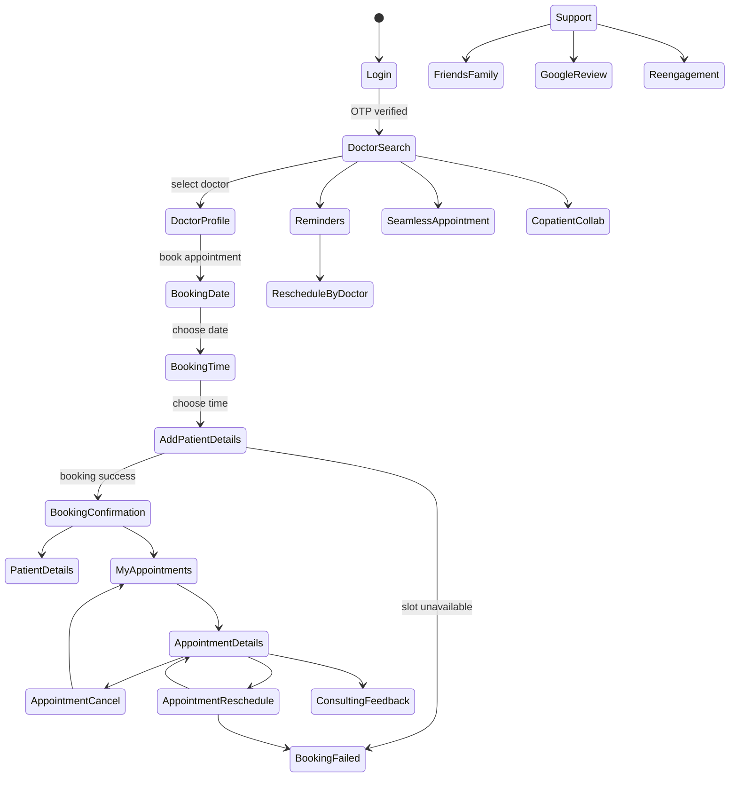
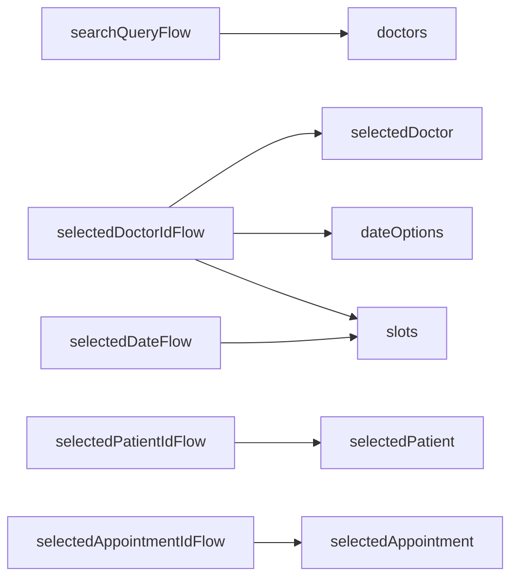

# State Flow

## App Screen State Machine

```mermaid
stateDiagram-v2
  [*] --> Login
  Login --> DoctorSearch: OTP verified

  DoctorSearch --> DoctorProfile: select doctor
  DoctorProfile --> BookingDate: book appointment
  BookingDate --> BookingTime: choose date
  BookingTime --> AddPatientDetails: choose time

  AddPatientDetails --> BookingConfirmation: booking success
  AddPatientDetails --> BookingFailed: slot unavailable

  BookingConfirmation --> PatientDetails
  BookingConfirmation --> MyAppointments

  MyAppointments --> AppointmentDetails
  AppointmentDetails --> AppointmentCancel
  AppointmentDetails --> AppointmentReschedule
  AppointmentDetails --> ConsultingFeedback

  AppointmentCancel --> MyAppointments
  AppointmentReschedule --> AppointmentDetails
  AppointmentReschedule --> BookingFailed

  DoctorSearch --> Reminders
  Reminders --> RescheduleByDoctor
  DoctorSearch --> SeamlessAppointment
  DoctorSearch --> CopatientCollab

  Support --> FriendsFamily
  Support --> GoogleReview
  Support --> Reengagement
```

## ViewModel State Sources

```mermaid
flowchart LR
  Q[searchQueryFlow] --> D[doctors]
  SD[selectedDoctorIdFlow] --> DOC[selectedDoctor]
  SD --> DATES[dateOptions]
  SD --> SLOTS
  DATE[selectedDateFlow] --> SLOTS[slots]
  SP[selectedPatientIdFlow] --> PAT[selectedPatient]
  SA[selectedAppointmentIdFlow] --> APPT[selectedAppointment]
```
