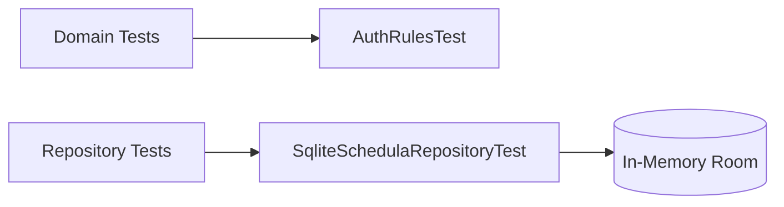

# Testing

## Current Test Coverage

- `AuthRulesTest`
  - phone validation rules
  - OTP validation rules
- `SqliteSchedulaRepositoryTest`
  - booking success path
  - slot conflict behavior
  - cancel + reschedule state transitions
  - payment/report/follow-up/feedback persistence
  - support ticket and support chat persistence
  - IVR plan conversion to appointment
  - reminder materialization from appointments + notices
  - invite/collaboration/review persistence
  - mocked API guardrails (availability, support validation, review validation)
- `AppViewModelIntegrationTest`
  - login + booking transition coverage
  - payment workflow action validation
  - support/review validation and success states
- `AllScreensCaptureReportTest`
  - renders all 23 screens without crash
  - exports per-screen PNG artifacts for manual verification

## Test Topology



## How to Run

```bash
./gradlew testDebugUnitTest
```

## Screen Verification Artifacts

- PNG captures path: `app/build/reports/screen-captures/`
- Capture index: `app/build/reports/screen-captures/index.md`
- PDF generation:

```bash
cd app/build/reports/screen-captures
magick $(ls -1 0[1-9]-*.png 1[0-9]-*.png 2[0-3]-*.png | sort) screen-report.pdf
```

## Suggested Next Tests

1. ViewModel transition tests for bottom tab routing and logout/login restore.
2. Compose UI tests for booking, reschedule, and support ticket forms.
3. Contract tests for mock APIs to keep deterministic behavior stable.
