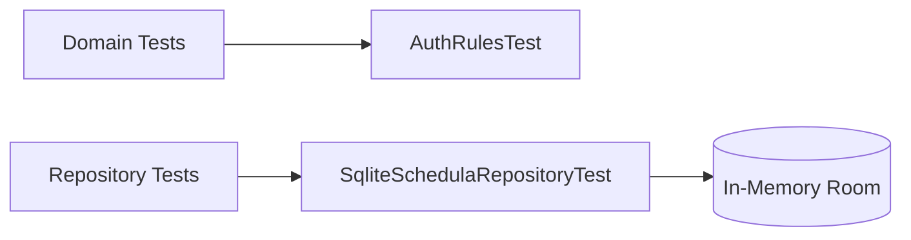

# Testing

## Current Test Coverage

- `AuthRulesTest`
  - phone validation rules
  - OTP validation rules
- `SqliteSchedulaRepositoryTest`
  - booking success path
  - slot conflict behavior
  - cancel + reschedule state transitions

## Test Topology



## How to Run

```bash
./gradlew testDebugUnitTest
```

## Suggested Next Tests

1. ViewModel screen transition tests.
2. Compose UI tests for booking happy path.
3. Regression tests for reminder/reschedule utility screens.
